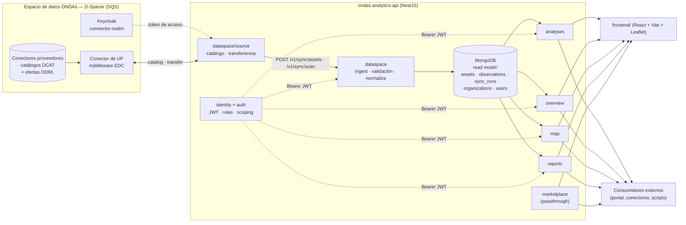

# ONDAs Analytics API

[](LICENSE)
[](https://nodejs.org/)
[](https://nestjs.com/)

API de analíticas del **espacio de datos ONDAs**. Expone los indicadores, el
cuadro de mando, el mapa y los informes de residuos marinos a partir de los
conjuntos de datos que cada participante publica en el espacio de datos.

Es el componente desarrollado en la **actividad A2.2 (API-ficación)** y la
evolución productiva del prototipo de notebooks de indicadores: los cálculos que
allí se hacían de forma manual aquí son endpoints HTTP versionados,
autenticados y documentados con OpenAPI.

- **Documentación interactiva (OpenAPI / Swagger):** `GET /docs`
- **Prefijo de todas las rutas:** `/v1`
- **Especificación descargable:** [docs/openapi.json](docs/openapi.json) · colección
  Postman en [docs/ONDAs_Analytics_API.postman_collection.json](docs/ONDAs_Analytics_API.postman_collection.json)

### Alcance de este repositorio

Contiene el código y la documentación que Universal Plastic ha desarrollado para el
caso de uso del espacio de datos ONDAs: consumo de los activos que los participantes
comparten a través del espacio de datos, analítica de contaminación por
geolocalización, cuadro de mando, mapa, informes y ejemplos de despliegue.

La capa de espacio de datos propiamente dicha —catálogo federado, conectores,
proveedor de identidad y registro de transacciones— se opera sobre la plataforma
**D-Spacer de SQS**, contratada como *Data Space as a Service*. Al ser un producto
comercial de terceros, su código fuente no forma parte de este repositorio; su
arquitectura e interfaces están documentadas en los entregables técnicos del
proyecto.

---

## 1. Arquitectura

El API **no consulta el espacio de datos en tiempo de petición**. Un proceso de
sincronización explícito consume los activos sobre los que Universal Plastic tiene
contrato, los normaliza a un modelo común y los deja en MongoDB como *read model*.
Todos los endpoints analíticos leen sólo de Mongo, lo que hace que la latencia de
consulta sea independiente del número de activos y del coste de negociar su
transferencia.



### Cómo se consume un activo

El espacio de datos no se lee como un almacén de ficheros: cada activo se obtiene
negociando su contrato. El conector de UP expone esa negociación como tres
operaciones, y el módulo `dataspace/source` las encadena.

| # | Operación del conector | Qué devuelve |
|---|---|---|
| 1 | `GET /bpn/all` | Los participantes del espacio, con su **BPN** y la dirección de su conector |
| 2 | `POST /catalog/request` | El **catálogo DCAT** de un proveedor: sus activos y la oferta ODRL de cada uno |
| 3 | `POST /transfer/request` | El **dato**, devolviendo la oferta del paso 2 como parte de la petición |

Tres consecuencias de diseño que explican cómo está construido el módulo:

- **La oferta no se puede cachear entre ejecuciones.** Su identificador incluye el
  nombre del activo, así que cambia si el proveedor lo renombra o recrea la
  política. El catálogo se relee antes de cada transferencia.
- **El catálogo no expone fecha, versión ni suma de comprobación.** No hay forma de
  saber si un activo cambió sin traerlo, de modo que la detección de cambios ocurre
  *después* de la transferencia, comparando el SHA-256 del contenido con el que ya
  está en el read model. Un activo sin cambios se resuelve como `unchanged` y no se
  reescribe.
- **El token de acceso vive 300 segundos**, menos que un escaneo completo. El
  cliente lo renueva a mitad de proceso; no es una optimización, es requisito de
  funcionamiento.

El acceso efectivo lo define el contrato que cada proveedor ha creado a favor del
BPN de Universal Plastic. Un activo sin contrato no aparece en el catálogo y el
API no puede verlo: **la autorización es del espacio de datos, no del API**.

### Módulos

| Módulo | Carpeta | Responsabilidad |
|---|---|---|
| `dataspace` | [src/api-v1/dataspace/](src/api-v1/dataspace/) | Consumo de activos del espacio de datos (catálogo y transferencia), validación DCAT y de contenedor, normalización de campos, escritura del read model, registro de ejecuciones de sync |
| `identity` | [src/api-v1/identity/](src/api-v1/identity/) | Organizaciones, usuarios, roles (`admin` / `provider` / `viewer`), guards y *scoping* de los datos por organización |
| `auth` | [src/api-v1/auth/](src/api-v1/auth/) | Login del portal, emisión y verificación de JWT |
| `analyses` | [src/api-v1/analyses/](src/api-v1/analyses/) | Cálculo de índices e indicadores y generación de gráficas (WebP / PDF) |
| `overview` | [src/api-v1/overview/](src/api-v1/overview/) | Agregados del cuadro de mando |
| `map` | [src/api-v1/map/](src/api-v1/map/) | Puntos geolocalizados de observaciones |
| `reports` | [src/api-v1/reports/](src/api-v1/reports/) | Informes periódicos en PDF (SVG + `pdf-lib`) |
| `marketplace` | [src/api-v1/marketplace/](src/api-v1/marketplace/) | Passthrough de campañas, limpiezas y organizaciones |
| `mongo` | [src/mongo/](src/mongo/) | Conexión Mongoose |

Integración con el conector, autenticación y flujo de consumo:
[docs/dspacer-integration.md](docs/dspacer-integration.md).
Modelo de datos y contrato de sincronización: [docs/dataspace-sync.md](docs/dataspace-sync.md).
Esquemas y estructura de cada tipo de dataset: [docs/dataset-mapping.md](docs/dataset-mapping.md).

### Datasets observados y de referencia

Los activos del espacio de datos se leen en dos niveles:

| Nivel | Origen | Quién lo lee |
|---|---|---|
| **Observado** | Los activos que cada participante comparte con UP en el espacio de datos, identificados por su asset id y el BPN de su proveedor | Todo: mapa, cuadro de mando, informes y analíticas |
| **Referencia** | Series de calibración generadas por el propio API, publicadas como activos propios de UP y definidas en [src/api-v1/dataspace/reference-datasets.ts](src/api-v1/dataspace/reference-datasets.ts) | Sólo `POST /v1/analyses/run`, y sólo cuando una categoría no tiene ningún dataset observado con datos en el área consultada |

Se ingieren por el mismo pipeline que cualquier otro activo y llevan su
procedencia declarada en `dct:provenance`, así que el catálogo distingue unas de
otras. El mapa, los KPIs del cuadro de mando y los informes las excluyen
explícitamente: describen mediciones de un sitio, y una serie de calibración no
lo es.

El nivel no se deduce de quién publica el activo, sino de su asset id, en la
tabla `REFERENCE_ASSETS` de
[asset-map.ts](src/api-v1/dataspace/source/asset-map.ts). Tiene que ser así:
quien las publica en el espacio es UP, el mismo participante que publica datos
observados, de modo que clasificarlas por su proveedor las metería en el nivel
observado — una serie sintética en mar abierto acabaría en el mapa, en los KPIs y
en la cuenca bajo la que se archiva cada análisis. Por lo mismo no llevan lugar
ni estación: un lugar las convertiría en el dataset más cercano a algún sitio, y
el sustituto empezaría a ganarle al dato real.

Regenerarlas y publicarlas:

```bash
npm run reference:generate   # escribe en output/reference/
```

> Una serie de referencia es un sustituto declarado, no un dato. A medida que los
> participantes comparten activos observados de una categoría, esa categoría deja
> de recurrir a ella. El informe de validación (§7) declara en cada ejecución qué
> categorías se respondieron con dato observado y cuáles con calibración.

La generación es determinista: el mismo rango produce ficheros byte a byte
idénticos.

---

## 2. Dependencias

### Entorno

| Requisito | Versión | Nota |
|---|---|---|
| Node.js | ≥ 18 | Probado en 20.x, que es la versión del servidor de producción |
| npm | ≥ 9 | Se usa `npm ci` con `package-lock.json` |
| MongoDB | ≥ 6 | Atlas o instancia propia. **Obligatorio**: todo endpoint analítico lee de Mongo |
| Credenciales de conector en el espacio de datos | — | Sólo necesarias para ejecutar la sincronización. Usuario y contraseña del conector de UP en `connector-realm`; el API obtiene y renueva el token de acceso por sí mismo |

### Runtime

| Paquete | Para qué |
|---|---|
| `@nestjs/core`, `@nestjs/common`, `@nestjs/platform-express` | Framework HTTP y de inyección de dependencias |
| `@nestjs/mongoose`, `mongoose` | Read model en MongoDB |
| `@nestjs/jwt`, `bcryptjs` | Autenticación por JWT y hash de contraseñas |
| `@nestjs/swagger`, `swagger-ui-express` | OpenAPI 3 en `/docs` |
| `@aws-sdk/client-s3`, `@aws-sdk/s3-request-presigner` | Almacenamiento de las **salidas** que genera el API: PDF de análisis, gráficas e informes |
| `class-validator`, `class-transformer` | Validación de DTOs de entrada |
| `pdf-lib`, `sharp` | Informes PDF y rasterizado de gráficas |
| `dotenv` | Carga de configuración |

Desarrollo: TypeScript 5, Jest + ts-jest, ESLint, Prettier, `@nestjs/cli`.
Lista completa y versiones exactas en [package.json](package.json).

El SPA de demostración en [frontend/](frontend/) es un proyecto npm aparte
(React 18, Vite, MUI, React Query, Leaflet) con su propio `package.json`.

---

## 3. Instalación

```bash
git clone https://github.com/UniversalPlastic-io/ondas_analytics_api.git
cd ondas_analytics_api
npm ci
cp .env.example .env      # editar MONGODB_URI y PORTAL_JWT_SECRET
```

### Configuración

Variables mínimas para arrancar (el resto, con sus valores por defecto, están
documentadas en [.env.example](.env.example)):

| Variable | Obligatoria | Descripción |
|---|---|---|
| `MONGODB_URI` | ✅ | Cadena de conexión a MongoDB |
| `MONGODB_DB` | — | Base de datos (por defecto `ondas_dataspace`) |
| `PORTAL_JWT_SECRET` | ✅ en producción | Secreto de firma del JWT. Cadena aleatoria larga |
| `PORTAL_JWT_EXPIRES_IN` | — | TTL del token (por defecto `8h`) |
| `DSPACER_BASE_URL` | para sync | URL del *middleware* del conector, incluido el segmento de entidad |
| `DSPACER_LOGIN_URL` | para sync | Endpoint de login del conector |
| `DSPACER_USER` | para sync | Usuario del conector en `connector-realm` |
| `DSPACER_PASSWORD` | para sync | Contraseña del conector. **Nunca se versiona** |
| `PORT` | — | Puerto HTTP (por defecto `3000`) |
| `PUBLIC_API_BASE_PATH` | — | Prefijo público tras un proxy inverso, sólo para los enlaces de Swagger |
| `PUBLIC_API_DISPLAY_URL` | — | URL pública completa mostrada en la documentación |

> `.env` está en `.gitignore`. Nunca se versiona: en el repositorio sólo hay
> plantillas `.env.example` con valores de ejemplo.

### Primer arranque

```bash
npm run seed          # crea organizaciones y usuarios; imprime las contraseñas una sola vez
npm run backfill      # rellena Mongo desde el catálogo del espacio de datos
npm run start:dev     # http://localhost:3000/docs
```

`npm run seed` imprime la contraseña generada del administrador **una única
vez**. Guárdala antes de cerrar la terminal, o regenérala después con
`npm run users:reset`.

### Scripts

| Comando | Efecto |
|---|---|
| `npm run start:dev` | Servidor en modo watch |
| `npm run start:prod` | Ejecuta `dist/main` (requiere `npm run build` previo) |
| `npm run build` | Compila TypeScript a `dist/` |
| `npm test` · `npm run test:cov` | Tests unitarios / con cobertura |
| `npm run lint` · `npm run format` | ESLint con `--fix` / Prettier |
| `npm run seed` | Semilla de organizaciones y usuarios |
| `npm run backfill` | Carga inicial del read model desde el catálogo del espacio de datos |
| `npm run reference:generate` | Regenera las series de referencia en `output/reference/` |
| `npm run assets:refresh` | Compara `ASSET_MAP` con el catálogo real (`-- --write` para reescribirla) |
| `npm run fixtures:refresh` | Recaptura los catálogos reales sobre los que corren las pruebas de `dataspace/source` |
| `npm run openapi:generate` | Regenera `docs/openapi.json` a partir de los decoradores |
| `npm run validate:precision` | Informe de validación: fidelidad de ingesta, exactitud de agregación, reproducibilidad y cobertura |
| `npm run users:export` · `npm run users:reset` | Exportar usuarios / restablecer contraseña |

---

## 4. Ejemplo mínimo de uso

Con el servidor en `http://localhost:3000`:

```bash
# 1. Obtener un token
TOKEN=$(curl -s -X POST http://localhost:3000/v1/auth/login \
  -H 'Content-Type: application/json' \
  -d '{"username":"admin@universalplastic.io","password":"<tu-password>"}' \
  | node -e "process.stdin.on('data',d=>console.log(JSON.parse(d).access_token))")

# 2. Cuadro de mando (con token se acota a tu organización)
curl -s 'http://localhost:3000/v1/overview?period=year' \
  -H "Authorization: Bearer $TOKEN"

# 3. Puntos del mapa — endpoint abierto, el token es opcional
curl -s 'http://localhost:3000/v1/map/points?format=geojson'

# 4. Ejecutar las analíticas de un área y un periodo
curl -s -X POST http://localhost:3000/v1/analyses/run \
  -H "Authorization: Bearer $TOKEN" \
  -H 'Content-Type: application/json' \
  -d '{
        "location": { "lat": 40.4168, "lon": -3.7038 },
        "area": { "type": "radius_km", "value": 25 },
        "analyses": ["all"],
        "dateRange": { "start": "2025-01-01", "end": "2025-12-31" }
      }'
```

`POST /v1/auth/login` devuelve `{ access_token, token_type, expires_in, username, user }`.

En `POST /v1/analyses/run` sólo `location`, `area` y `analyses` son
obligatorios; omitir `dateRange`, `aggregation` y `options` aplica los valores
por defecto del API (rango predefinido, agregación `raw`, sin generación de
ficheros). `options.savePlotsWebp` y `options.dataFormattedForPlots` activan
las gráficas. Swagger trae varios ejemplos de cuerpo listos para ejecutar.

`GET /v1/analyses/indices` es una **página HTML** que documenta los índices e
indicadores implementados y su fórmula.

Sin token, `GET /v1/overview` y `GET /v1/map/points` responden con el agregado
público de todo el espacio de datos. Con token el ámbito por defecto es
`scope=mine` (sólo tu organización) y `scope=all` vuelve al agregado completo.
`map/points` filtra además por `ocean`, `datasetType` y `provider`, y devuelve
GeoJSON con `format=geojson`.

### Endpoints

| Método | Ruta | Auth |
|---|---|---|
| `POST` | `/v1/auth/login` | — |
| `GET` | `/v1/auth/me` | Bearer |
| `GET` | `/v1/overview` | Bearer opcional (con token acota a tu organización) |
| `GET` | `/v1/map/points` | Bearer opcional (idem) |
| `GET` | `/v1/analyses/indices` | — (documentación HTML de los índices) |
| `POST` | `/v1/analyses/run` | Bearer |
| `POST` | `/v1/reports/request` | — |
| `POST` | `/v1/sync/assets` · `/v1/sync/scan` | Bearer (`admin` / `provider`) |
| `GET` | `/v1/sync/runs` · `/v1/sync/runs/:id` | Bearer (`admin` / `provider`) |
| `GET`/`POST`/`PUT` | `/v1/admin/organizations` | Bearer (`admin`) |
| `GET`/`POST` | `/v1/admin/users` · `PUT /v1/admin/users/password` | Bearer (`admin`) |
| `GET` | `/v1/campaigns` · `/v1/cleanups` · `/v1/organizations` | — (passthrough de marketplace) |

Contrato completo, esquemas de respuesta y códigos de error: `/docs`.

---

## 5. Despliegue

Tres ejemplos completos y reproducibles:

1. **[Docker Compose](docs/deployment/01-docker-compose.md)** — API + MongoDB en
   contenedores, de cero a servicio funcionando con un comando. Para evaluación,
   demostración y entornos de preproducción.
2. **[Servidor Linux con Nginx + PM2](docs/deployment/02-nginx-pm2.md)** — la
   topología en uso en producción: TLS, servicio supervisado por PM2 y el SPA
   servido como ficheros estáticos en el mismo origen que el API.
3. **[Monitorización con Prometheus y Grafana](docs/deployment/03-monitoring.md)**
   — métricas en `GET /metrics` y cuadro de mando provisionado, en el perfil
   `monitoring` del mismo `docker-compose.yml`.

---

## 6. Estructura del repositorio

```
├── src/                  código del API (NestJS)
│   ├── api-v1/           módulos de dominio (ver §1)
│   │   └── dataspace/
│   │       └── source/   cliente del conector: catálogo y transferencia
│   ├── mongo/            conexión Mongoose
│   └── main.ts           bootstrap, CORS y configuración de Swagger
├── scripts/              seed, backfill, gestión de usuarios, generadores de muestras
├── monitoring/           Prometheus y Grafana (dashboard versionado)
├── frontend/             SPA de demostración (React + Vite)
├── docs/                 documentación técnica y de despliegue
└── config/               configuración local (no versionada)
```

Los tests viven junto al código que prueban, como `*.spec.ts`.

---

## 7. Validación

El informe de validación —fidelidad de ingesta, exactitud de agregación,
reproducibilidad, cobertura de consulta y concordancia entre fuentes— está en
[docs/validacion-precision.md](docs/validacion-precision.md) y se regenera con:

```bash
npm run validate:precision
```

Termina con código distinto de cero si alguna comprobación falla o aparece
pérdida de datos inexplicada, así que sirve como comprobación automatizada.

---

## 8. Notas de versión

Cambios por versión en [CHANGELOG.md](CHANGELOG.md).

---

## 9. Licencia

Apache License 2.0 — ver [LICENSE](LICENSE) y [NOTICE](NOTICE).

Desarrollado por [Universal Plastic](https://universalplastic.io) en el marco del
proyecto del espacio de datos ONDAs.
