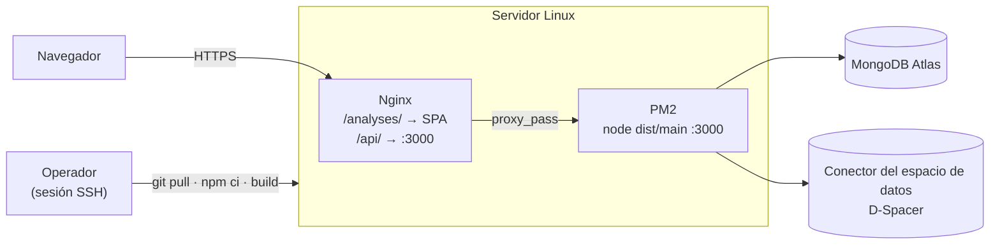

# Ejemplo de despliegue 2 — Servidor Linux con Nginx y PM2

Despliegue del API y del SPA en un servidor Linux, con TLS, servicio supervisado
por PM2 y un único origen para ambos. Es la topología **en uso en producción**.

Frente al [ejemplo 1](01-docker-compose.md), aquí el objetivo es otro: servicio
permanente detrás de HTTPS, reinicio automático tras un *reboot* y el SPA servido
como ficheros estáticos junto al API.

---

## 1. Topología



El SPA se sirve como ficheros estáticos bajo `/analyses/` y el API se publica
bajo `/api/`, ambos en el mismo origen. Por eso el SPA se compila con
`--base=/analyses/` y el API recibe `PUBLIC_API_BASE_PATH=/api`: sin ese
prefijo, el botón *Try it out* de Swagger generaría URLs sin `/api` y daría 404
detrás del proxy.

## 2. Preparación del servidor (una sola vez)

```bash
# Node 20 y PM2
curl -fsSL https://deb.nodesource.com/setup_20.x | sudo -E bash -
sudo apt-get install -y nodejs nginx
sudo npm i -g pm2

# Clon del API
sudo mkdir -p /home/ubuntu && cd /home/ubuntu
git clone https://github.com/UniversalPlastic-io/ondas_analytics_api.git
cd ondas_analytics_api
npm ci && npm run build

# Configuración: .env NO se versiona, se crea aquí
cp .env.example .env && nano .env     # MONGODB_URI, PORTAL_JWT_SECRET, PUBLIC_API_*

# Raíz web del SPA
sudo mkdir -p /var/www/ondas/analyses
sudo chown -R ubuntu:ubuntu /var/www/ondas

# Datos iniciales
npm run seed        # anota la contraseña del administrador: se imprime una vez
npm run backfill

# Arranque bajo PM2 con reinicio automático tras un reboot
pm2 start dist/main.js --name ondas-analytics-api --update-env
pm2 save
pm2 startup         # ejecutar el comando que imprime
```

`npm run seed` imprime la contraseña del administrador **una sola vez**;
`npm run users:reset` la restablece si se pierde.

### Variables del `.env` del servidor

| Variable | Valor de producción |
|---|---|
| `MONGODB_URI` | Cadena de conexión de Atlas |
| `PORTAL_JWT_SECRET` | Cadena aleatoria larga |
| `PUBLIC_API_BASE_PATH` | `/api` |
| `PUBLIC_API_DISPLAY_URL` | `https://ondas.universalplastic.io/api` |
| `DSPACER_BASE_URL` · `DSPACER_LOGIN_URL` | *Middleware* y endpoint de login del conector de UP |
| `DSPACER_USER` · `DSPACER_PASSWORD` | Credenciales del conector en `connector-realm` |
| `DSPACER_PUBLISH_ENABLED` | Sin definir. Encenderla publica cada análisis generado en el catálogo compartido — ver [report-publishing.md](../report-publishing.md) |

Las cuatro `DSPACER_*` sólo hacen falta para sincronizar y para publicar: los
endpoints analíticos leen de Mongo y el servicio arranca sin ellas, avisando en el
log.

El SPA se compila con `VITE_API_BASE_URL=https://ondas.universalplastic.io/api`.

### Nginx

```nginx
server {
  listen 443 ssl http2;
  server_name ondas.universalplastic.io;

  ssl_certificate     /etc/letsencrypt/live/ondas.universalplastic.io/fullchain.pem;
  ssl_certificate_key /etc/letsencrypt/live/ondas.universalplastic.io/privkey.pem;

  # SPA de analíticas
  location /analyses/ {
    alias /var/www/ondas/analyses/;
    try_files $uri $uri/ /analyses/index.html;
  }

  # /metrics no requiere autenticación y revela rutas internas, volúmenes y
  # tasas de error: Prometheus lo recoge por 127.0.0.1, no por el proxy público.
  # Ver docs/deployment/03-monitoring.md.
  location = /api/metrics {
    deny all;
    return 404;
  }

  # API: /api/v1/... → :3000/v1/...
  location /api/ {
    proxy_pass         http://127.0.0.1:3000/;
    proxy_http_version 1.1;
    proxy_set_header   Host              $host;
    proxy_set_header   X-Real-IP         $remote_addr;
    proxy_set_header   X-Forwarded-For   $proxy_add_x_forwarded_for;
    proxy_set_header   X-Forwarded-Proto $scheme;
    proxy_set_header   Authorization     $http_authorization;
    # Los informes PDF y las gráficas pueden tardar: margen sobre los 60 s por defecto.
    proxy_read_timeout 300s;
    client_max_body_size 25m;
  }
}

server {
  listen 80;
  server_name ondas.universalplastic.io;
  return 301 https://$host$request_uri;
}
```

La barra final de `proxy_pass http://127.0.0.1:3000/` es significativa: elimina
el prefijo `/api` antes de reenviar, que es lo que espera Nest (sirve `/v1` y
`/docs` en la raíz). Certificado con `sudo certbot --nginx -d ondas.universalplastic.io`.

## 3. Publicar una nueva versión

Cuatro comandos en el servidor, por SSH:

```bash
cd /home/ubuntu/ondas_analytics_api
git pull --ff-only origin main
npm ci && npm run build
pm2 restart ondas-analytics-api --update-env && pm2 save
```

Y el SPA, si ha cambiado:

```bash
cd frontend
npm ci
VITE_API_BASE_URL=https://ondas.universalplastic.io/api npm run build -- --base=/analyses/
rsync -a --delete dist/ /var/www/ondas/analyses/
```

`--delete` retira los ficheros de compilaciones anteriores: sin él, los *assets*
con nombre versionado se acumulan indefinidamente.

Dos consecuencias del procedimiento que conviene tener presentes:

- **No se edita código en el servidor.** `git pull --ff-only` falla si alguien lo
  hizo, en lugar de arrastrar el cambio en silencio. `.env` y
  `config/portal-connectors.local.json` sobreviven porque no están versionados.
- **No se ejecutan migraciones ni `backfill` automáticamente.** Si un cambio
  altera el modelo del *read model*, hay que lanzar la sincronización después
  (`npm run backfill`, o `POST /v1/sync/scan` con un token de `admin`).

## 4. Verificación tras el despliegue

```bash
curl -sI https://ondas.universalplastic.io/api/docs                 # 200
curl -s  https://ondas.universalplastic.io/api/v1/map/points | head -c 300
curl -sI https://ondas.universalplastic.io/analyses/                # 200
```

En el servidor:

```bash
pm2 status ondas-analytics-api
pm2 logs ondas-analytics-api --lines 100
```

## 5. Reversión

```bash
cd /home/ubuntu/ondas_analytics_api
git reset --hard <sha-anterior>
npm ci && npm run build
pm2 restart ondas-analytics-api --update-env
```

Conviene acompañarla de un `git revert` sobre `main`, para que servidor y
repositorio queden alineados: una reversión hecha solo en el servidor la deshace
el siguiente `git pull`.

## 6. Incidencias frecuentes

| Síntoma | Causa | Solución |
|---|---|---|
| 502 en `/api/` | El proceso PM2 está caído | `pm2 logs` — normalmente `MONGODB_URI` mal o `PORTAL_JWT_SECRET` ausente en el `.env` del servidor |
| `git pull` rechazado | Se editó código en el servidor | `git status` para ver qué cambió; llevar el cambio al repositorio y volver a desplegar |
| Swagger carga pero *Try it out* da 404 | `PUBLIC_API_BASE_PATH` no está fijado, o falta la barra final en `proxy_pass` | Fijar la variable y reiniciar con `--update-env`; revisar Nginx |
| El SPA carga en blanco con 404 de los assets | El SPA no se compiló con `--base=/analyses/` | Recompilar y volver a sincronizar |
| Recargar una ruta interna del SPA da 404 | Falta el `try_files` de Nginx | Añadir el bloque `location /analyses/` de la §2 |
| 401 en todas las llamadas tras un despliegue | Se cambió `PORTAL_JWT_SECRET` | Esperado: invalida los tokens emitidos. Volver a hacer login |

La monitorización de este despliegue está en el [ejemplo 3](03-monitoring.md).
